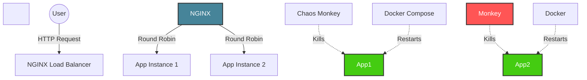

\# 🛡️ Indestructible Container Architecture


> \*\*A Chaos Engineering Proof-of-Concept\*\*

> \*Achieving Zero-Downtime \& Self-Healing with Docker, NGINX, and Python.\*


\## 📖 Overview


This project demonstrates a production-grade \*\*Resilient Architecture\*\* capable of surviving random server failures ("Chaos") and performing software updates ("Evolution") without a single second of downtime for the user.


It simulates a real-world environment where a \*\*Chaos Monkey\*\* script randomly kills backend servers, forcing the system to self-heal while maintaining 100% availability.


\## 🏗️ Architecture





The system is built on the \*\*"Redundant Load Balancer"\*\* pattern:


\* \*\*Gatekeeper (NGINX):\*\* A reverse proxy that distributes traffic and instantly detects failures.

\* \*\*The Fleet (Flask Apps):\*\* Two identical Python web servers (`instance-01`, `instance-02`).

\* \*\*The Supervisor (Docker Compose):\*\* Enforces a `restart: always` policy to resurrect dead containers.

\* \*\*The Chaos Monkey:\*\* A Python bot that randomly terminates containers to test resilience.


\## 🚀 Quick Start


\### Prerequisites

\* \[Docker Desktop](https://www.docker.com/products/docker-desktop)

\* Python 3.x


\### 1. Start the Infrastructure

Launch the cluster in detached mode.


```bash

docker-compose up -d --build

```


\### 2. Start the Availability Monitor

Run the tester script to watch the system's heartbeat. It prints the HTTP status and Response Time in real-time.


```bash

python tester.py

```

> \*\*Goal:\*\* Keep this running. You want to see `✅ 200 OK` continuously.


\### 3. Release the Chaos Monkey 🐵

Run the automation script that randomly kills containers.


```bash

python chaos\_monkey.py

```

> \*\*Observation:\*\* You will see containers dying and restarting. The `tester.py` should remain Green (200 OK) as NGINX fails over instantly.


\## 🧪 Experiments \& Scenarios


\### Scenario A: The "Invisible" Failure

1\. With the Chaos Monkey running, watch `tester.py`.

2\. Even when a container is killed, you will notice \*\*Zero Errors\*\*.

3\. You might see a slight latency spike (e.g., 15ms -> 1000ms) as NGINX waits for the timeout and switches to the backup server.


\### Scenario B: The "Rolling Update" (Zero-Downtime Deployment)

How to upgrade from \*\*Version 1\*\* to \*\*Version 2\*\* without stopping the system:


1\. Modify `app/server.py` and change the return message (e.g., to `"🚀 v2.0 is here!"`).

2\. Update \*\*only\*\* App 1:


```bash

docker-compose up -d --no-deps --build app1

```


3\. Watch `tester.py`. You will see a mix of "Alive!" (v1) and "v2.0" messages.

4\. Update App 2 to complete the rollout:


```bash

docker-compose up -d --no-deps --build app2

```


\## 📂 Project Structure


```plaintext

.

├── app/

│   ├── Dockerfile         # Python environment setup

│   ├── server.py          # Flask app with /crash endpoint

│   └── requirements.txt   # Dependencies

├── chaos\_monkey.py        # The "Villain": Randomly kills containers

├── docker-compose.yml     # The Blueprint: Defines the cluster

├── nginx.conf             # The Traffic Cop: Load balancing rules

├── tester.py              # The User: Monitors availability

└── README.md              # You are here

```


\## ⚙️ Configuration Details


\### Self-Healing Mechanism:

We use the Docker Restart Policy in `docker-compose.yml`:


```yaml

restart: always

```


\### Failover Mechanism:

We configure NGINX to detect failures in `nginx.conf`:


```nginx

proxy\_connect\_timeout 1s;

proxy\_next\_upstream error timeout http\_500;

```


\## 🤝 Contributing

Feel free to fork this project and add \*\*Prometheus/Grafana\*\* monitoring or deploy it to \*\*Kubernetes\*\*!


\## 📜 License

MIT License. Built for educational purposes in Chaos Engineering.

